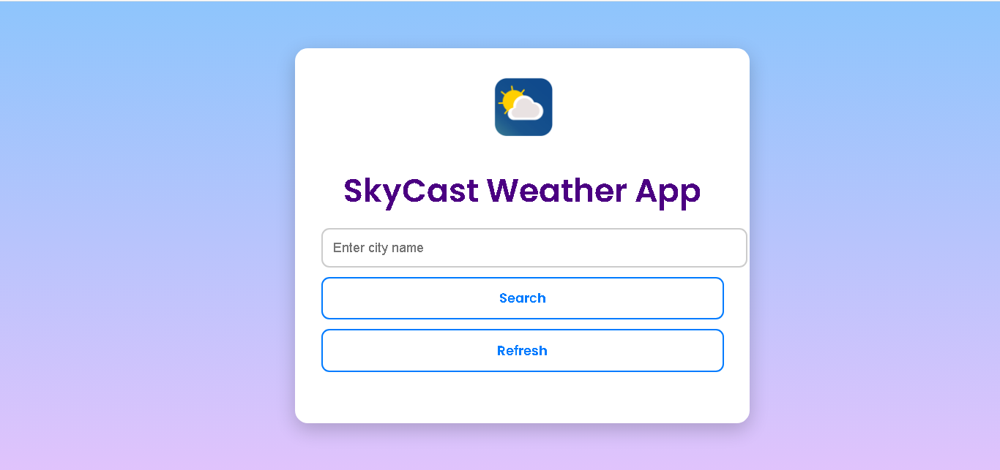
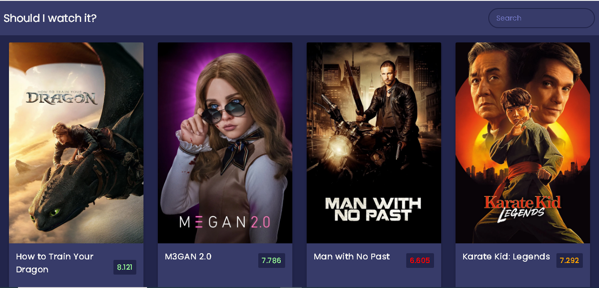

# 💻 M. Mythily — Personal Portfolio Website

This is a responsive and modern portfolio website built using **HTML, CSS, JavaScript, and Bootstrap**. It showcases my web development projects, education, certifications, and contact information.

---

## 🚀 Live Demo

🔗 [View Portfolio](https://mythilymanju.github.io/portfolio/)  
📄 [Download Resume](document/Mythily_resume.pdf)

---

## 🛠️ Tech Stack

- HTML5  
- CSS3  
- JavaScript  
- Bootstrap 4.3.1  
- Owl Carousel  
- FontAwesome & Unicons  

---

## 🧠 What I Learned

- Building responsive layouts using Bootstrap grid system  
- Animating content with Owl Carousel  
- Structuring and styling components with reusable code  
- Integrating contact forms using Formspree  
- Hosting portfolios with GitHub Pages  

---

## 📁 Project Sections

### ✨ About
Brief introduction, skills, and resume download.

### 🎯 Projects
- **SkyCast** – React + Vite-based weather app using OpenWeatherMap API  
  🔗 [GitHub](https://github.com/Mythilymanju/skycast-weather-app) | 🌐 [Live](https://weatherzone-sky.netlify.app)

- **MovieFlix** – Movie browsing app using TMDB API  
  🔗 [GitHub](https://github.com/Mythilymanju/movie-app) | 🌐 [Live](https://movieflix-mythily.netlify.app)

### 🎓 Education
Details of academic qualifications including BCA (87%).

### 📜 Certificates
- Frontend Web Development – Skifter Technology  
- HTML, CSS & JavaScript Basics – Skifter Technology  
- React Development Essentials – Skifter Technology  

### 📬 Contact
Integrated contact form (Formspree) and social media links.

---

## 📷 Screenshots

  

---

## 🧾 License

This project is open for personal portfolio use. Feel free to use and modify with credit.

---

## 🙋‍♀️ About Me

I'm **M. Mythily**, a passionate web developer focused on building full-stack web applications. Currently learning MERN stack and building real-world projects.

📧 mythilymanju4@gmail.com  
📱 +91 9363048100  
🔗 [Portfolio](https://yourusername.github.io/portfolio)  
🔗 [GitHub](https://github.com/Mythilymanju)  
🔗 [LinkedIn](https://linkedin.com/in/mythilymanju)
